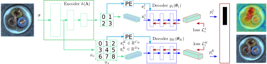

[](https://paperswithcode.com/sota/anomaly-detection-on-mvtec-ad?p=cflow-ad-real-time-unsupervised-anomaly)

## CFLOW-AD: Real-Time Unsupervised Anomaly Detection with Localization via Conditional Normalizing Flows
WACV 2022 preprint:[https://arxiv.org/abs/2107.12571](https://arxiv.org/abs/2107.12571)

## Abstract
Unsupervised anomaly detection with localization has many practical applications when labeling is infeasible and, moreover, when anomaly examples are completely missing in the train data. While recently proposed models for such data setup achieve high accuracy metrics, their complexity is a limiting factor for real-time processing. In this paper, we propose a real-time model and analytically derive its relationship to prior methods. Our CFLOW-AD model is based on a conditional normalizing flow framework adopted for anomaly detection with localization. In particular, CFLOW-AD consists of a discriminatively pretrained encoder followed by a multi-scale generative decoders where the latter explicitly estimate likelihood of the encoded features. Our approach results in a computationally and memory-efficient model: CFLOW-AD is faster and smaller by a factor of 10x than prior state-of-the-art with the same input setting. Our experiments on the MVTec dataset show that CFLOW-AD outperforms previous methods by 0.36% AUROC in detection task, by 1.12% AUROC and 2.5% AUPRO in localization task, respectively. We open-source our code with fully reproducible experiments.

## BibTex Citation
If you like our [paper](https://arxiv.org/abs/2107.12571) or code, please cite its WACV 2022 preprint using the following BibTex:
```
@inproceedings{Gudovskiy_2022_WACV,
    author    = {Gudovskiy, Denis and Ishizaka, Shun and Kozuka, Kazuki},
    title     = {{CFLOW-AD}: Real-Time Unsupervised Anomaly Detection With Localization via Conditional Normalizing Flows},
    booktitle = {Proceedings of the IEEE/CVF Winter Conference on Applications of Computer Vision (WACV)},
    month     = {January},
    year      = {2022},
    pages     = {98-107}
}
```

## Installation
- Clone this repository: tested on Python 3.8
- Install [PyTorch](http://pytorch.org/): tested on v1.8
- Install [FrEIA Flows](https://github.com/VLL-HD/FrEIA): tested on [the recent branch](https://github.com/VLL-HD/FrEIA/tree/4e0c6ab42b26ec6e41b1ee2abb1a8b6562752b00)
- Other dependencies in requirements.txt

Install all packages with this command:
```
$ python3 -m pip install -U -r requirements.txt
```

## Datasets
We support [MVTec AD dataset](https://www.mvtec.com/de/unternehmen/forschung/datasets/mvtec-ad/) for anomaly localization in factory setting and [Shanghai Tech Campus (STC)](https://svip-lab.github.io/dataset/campus_dataset.html) dataset with surveillance camera videos. Please, download dataset from URLs and extract to *data* folder or make symlink to that folder or [change default data path in main.py](https://github.com/gudovskiy/cflow-ad/blob/6a520d5eeb60e7df99a644f31836fb5cf7ffbfde/main.py#L48)).

## Code Organization
- ./custom_datasets - contains dataloaders for MVTec and STC
- ./custom_models - contains pretrained feature extractors

## Training Models
- Run code by selecting class name, feature extractor, input size, flow model etc.
- The commands below should reproduce our reference MVTec results using WideResnet-50 extractor:
```
python3 main.py --gpu 0 --pro -inp 512 --dataset mvtec --class-name bottle
python3 main.py --gpu 0 --pro -inp 256 --dataset mvtec --class-name cable
python3 main.py --gpu 0 --pro -inp 256 --dataset mvtec --class-name capsule
python3 main.py --gpu 0 --pro -inp 512 --dataset mvtec --class-name carpet
python3 main.py --gpu 0 --pro -inp 512 --dataset mvtec --class-name grid
python3 main.py --gpu 0 --pro -inp 256 --dataset mvtec --class-name hazelnut
python3 main.py --gpu 0 --pro -inp 512 --dataset mvtec --class-name leather
python3 main.py --gpu 0 --pro -inp 256 --dataset mvtec --class-name metal_nut
python3 main.py --gpu 0 --pro -inp 256 --dataset mvtec --class-name pill
python3 main.py --gpu 0 --pro -inp 512 --dataset mvtec --class-name screw
python3 main.py --gpu 0 --pro -inp 512 --dataset mvtec --class-name tile
python3 main.py --gpu 0 --pro -inp 512 --dataset mvtec --class-name toothbrush
python3 main.py --gpu 0 --pro -inp 128 --dataset mvtec --class-name transistor
python3 main.py --gpu 0 --pro -inp 512 --dataset mvtec --class-name wood
python3 main.py --gpu 0 --pro -inp 512 --dataset mvtec --class-name zipper
```

## Testing Pretrained Models
- Download pretrained weights from [Google Drive](https://drive.google.com/drive/folders/1u_DupllCxl1yWvKjf_T6HMPnBoV7cV7o?usp=sharing)
- The command below should reproduce MVTec results using light-weight MobileNetV3L extractor (AUROC, AUPRO) = (98.38%, 94.72%):
```
python3 main.py --gpu 0 --pro -enc mobilenet_v3_large --dataset mvtec --action-type norm-test -inp INPUT --class-name CLASS --checkpoint PATH/FILE.PT
```

## CFLOW-AD Architecture


## Reference CFLOW-AD Results for MVTec

